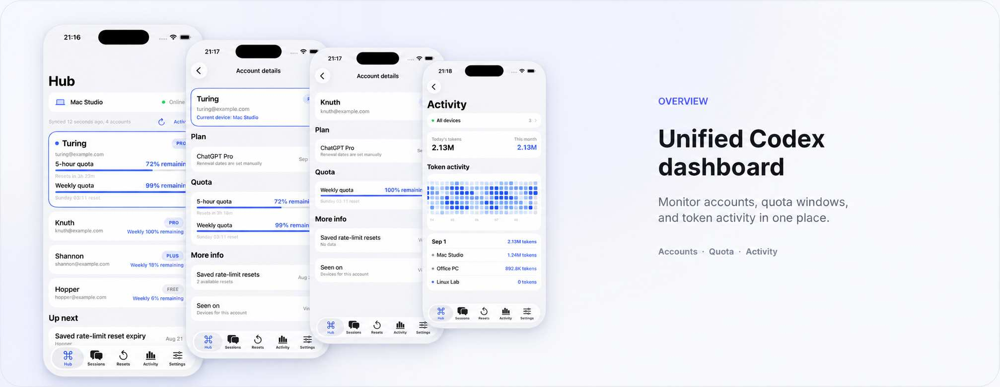
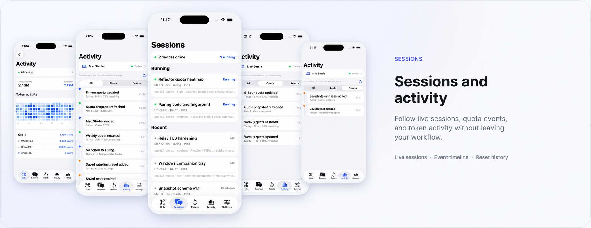
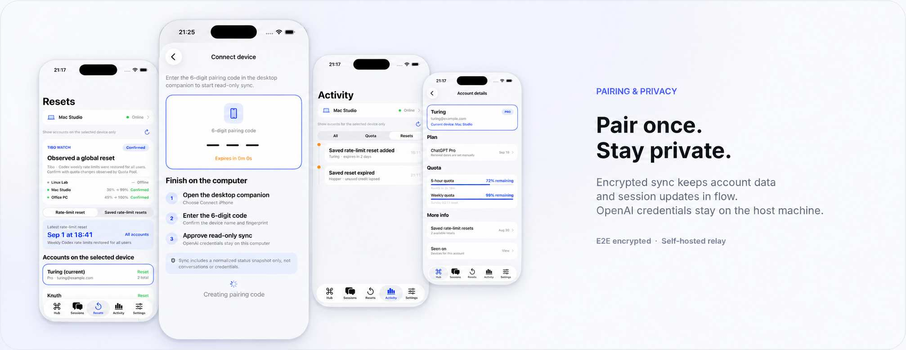

# Quota Pool

A personal, self-hosted console for monitoring Codex account state, quota windows, token usage, reset activity, and remote sessions across paired Mac and Windows hosts.

> **License:** Quota Pool is open-source software licensed under the GNU Affero General Public License v3.0 (`AGPL-3.0-only`). Commercial use is permitted under the AGPL when its terms are followed. Organizations that need proprietary terms incompatible with the AGPL may request a separate commercial license. See [LICENSE](LICENSE), [COMMERCIAL-LICENSE.md](COMMERCIAL-LICENSE.md), and [ACCEPTABLE_USE.md](ACCEPTABLE_USE.md).

> **Independent project notice:** This project is not affiliated with, endorsed by, sponsored by, or approved by OpenAI. OpenAI, ChatGPT, GPT, Codex, and related marks belong to their respective owners and are referenced only to describe compatibility. Use of Codex through this software remains subject to OpenAI's then-current terms, service terms, usage policies, and usage limits.
>
> Quota Pool monitors multiple locally configured Codex environments. It does **not** combine quotas, automatically switch accounts to evade usage limits, share or resell subscriptions, turn subscriptions into an API, or redeem saved rate-limit resets from the iPhone client.

---

## Quota Pool at a glance

### One dashboard for accounts, devices, quotas, and token activity



Bring Codex state from multiple local environments into one place. Quickly check:

- Account and device state across multiple Codex environments
- 5-hour and weekly quota windows, including reset times
- Remaining quota and recent quota changes
- Token usage and activity patterns
- Which device is currently associated with each environment

If you use Codex across multiple environments or switch between Mac and Windows, Quota Pool removes the need to repeatedly check separate windows and machines just to understand your current state.

### Sessions, activity, and reset history in one timeline



Quota Pool shows more than just remaining quota. It also keeps recent sessions and important state changes together so you can quickly understand what just happened.

You can review:

- Active Codex sessions
- The device and local environment associated with each session
- Quota updates and device-sync activity
- Quota reset history
- Remote Session state on paired devices

On a paired device, Remote Session can also read and resume an existing Codex thread, start a new turn, steer or interrupt a turn owned by Quota Pool, and respond to approval requests.

### Pair once and keep credentials on the host



Quota Pool is designed around a simple boundary: **sync status data, keep credentials on the host**.

- OpenAI credentials stay on the machine running the Codex App Server
- Quota Pool does not read or copy `~/.codex/auth.json`
- Pairing keys and device tokens are stored in the platform secure store
- Snapshots, remote commands, and Remote Session content are encrypted with the pairing key before reaching the relay
- The relay receives ciphertext and routing metadata rather than the protected content in plaintext
- The relay can be self-hosted so the infrastructure remains under your control

Remote Session content may include conversation text, command text, approval details, and status updates. For a complete description of the data boundary, see [PRIVACY.md](PRIVACY.md) and [SECURITY.md](SECURITY.md).

---

## Who is Quota Pool for?

If you use one Codex environment on one machine, the standard Codex interface may already be enough.

Quota Pool becomes more useful when you work with **multiple local Codex environments, multiple devices, or recurring quota and session monitoring**. It turns information that would otherwise be scattered across machines into one control surface.

Its goal is not to replace Codex. It is to help you answer questions such as:

- How much quota is left in each environment?
- When does each quota window reset?
- Which device is running which session?
- What changed recently?
- How can I securely continue existing work from a paired device?

---

## Project structure

- `ios/`: iOS 26 SwiftUI client
- `companions/macos/`: macOS 26 SwiftUI desktop companion
- `companions/windows/`: Windows 11 .NET 8 WPF desktop companion
- `relay/`: pairing and encrypted-snapshot relay

---

## Capability boundary

Quota and account-management surfaces are read-only.

Remote Session is the remote-control surface. On a paired device, it can read and resume an existing Codex thread, start a turn, steer or interrupt a turn owned by Quota Pool, and respond to approval requests.

These controls operate through the locally installed Codex App Server. Quota Pool does not read or copy `~/.codex/auth.json`.

---

## Quick start

1. On a Mac, install Xcode 26 and [XcodeGen](https://github.com/yonaskolb/XcodeGen).
2. Generate the iOS project:
   ```bash
   cd ios
   xcodegen generate
   ```
   Then open the generated `CodexAccounts.xcodeproj`.
3. Generate the macOS companion project:
   ```bash
   cd companions/macos
   xcodegen generate
   ```
   Then open the generated `CodexAccountsCompanion.xcodeproj`.
4. On Windows, use Visual Studio 2026 or run:
   ```bash
   dotnet build companions/windows/CodexAccounts.Companion.sln
   ```
5. Start the relay locally:
   ```bash
   cd relay
   npm test
   npm start
   ```

Public deployments must use HTTPS/WSS. You can provide TLS directly with `TLS_CERT_PATH` / `TLS_KEY_PATH`, or terminate TLS at a reverse proxy and set `RELAY_ORIGIN`.

Binding `0.0.0.0` without TLS requires `RELAY_BEHIND_PROXY=1` or `RELAY_ALLOW_CLEARTEXT=1`. Clients reject public `http://` relay URLs. See `relay/.env.example` for more configuration details.

Before signing on an Apple device, select your own Apple Developer team in Xcode and replace the placeholder Bundle IDs (`com.example.*`) if needed.

The first launch starts empty. The project does not bundle accounts, sessions, transcripts, relay addresses, or maintainer-specific state.

For first-time setup:

1. Open **Settings → Privacy & Sync**
2. Enter your relay URL
3. Open **Devices → Connect Device**
4. Generate a 6-digit pairing code and pair the device

---

## Data boundary and privacy

OpenAI credentials remain on the host running the Codex App Server.

The iPhone and desktop apps may store the following data locally:

- Account email addresses
- Device information
- Quota and activity data
- Aliases
- Usage history
- Session metadata

Pairing keys and device tokens use the platform secure store.

Snapshots, remote commands, and Remote Session content are encrypted with the pairing key before they reach the relay. The relay receives ciphertext and routing metadata rather than that content in plaintext.

For security reports, follow [SECURITY.md](SECURITY.md). Never put secrets, tokens, private keys, conversation contents, or personal data in a public issue.
